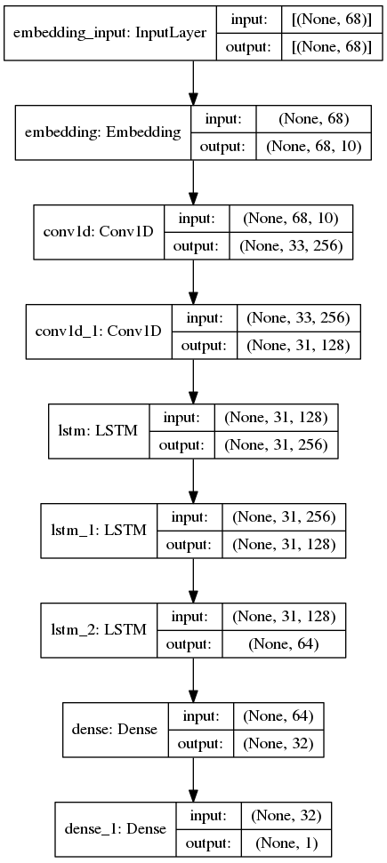
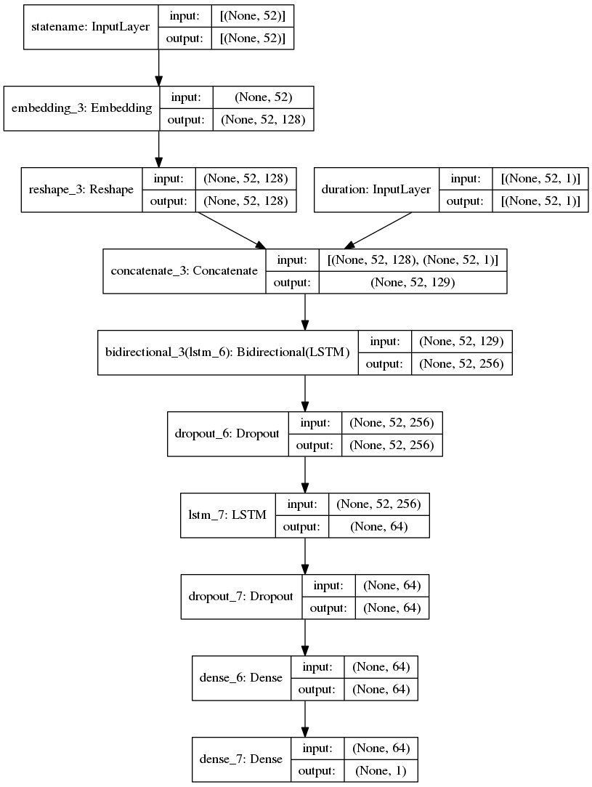

# EQ Major Down Summary README

NLP Approach for sequence classification. Unsatisfactory model precision and recall becasue the input data seems to be too random and there is no clear relationship between input data and output label (as proven by further EDA based on intuition)  

Best Results when using different data sources:  

| Data source   | Test Precision | Test Recall  |
| ------------- |:----:|:---:|
| Alarm         | 78 | 44 |
| Eq Status and its respective duration | 49 | 47 |

-Model used  

- Alarm Sequence LSTM  

- State Name & Duration Sequence LSTM  

- Combined features LSTM

