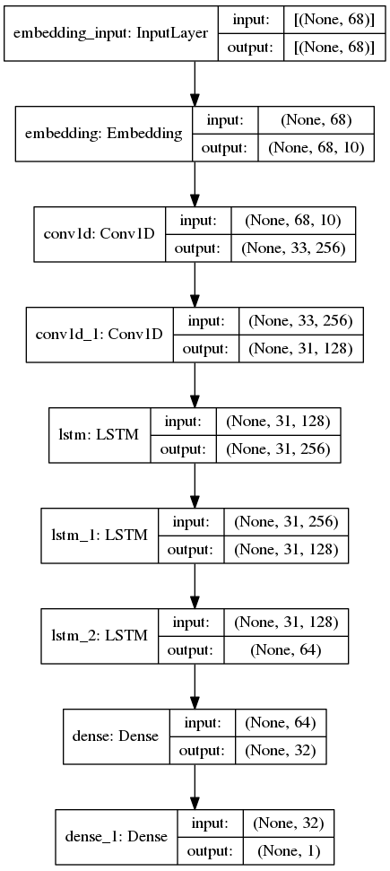
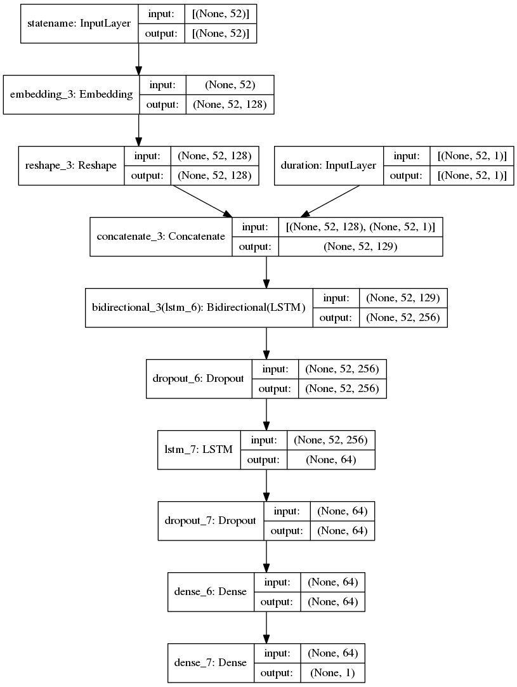

# EQ Major Down Summary README

The folders are sorted based on timeline. With each timeline consisting multiple approaches.  

1. June 2021
    - Multiple features aggregated over 7 days

2. August 2021
    - NLP Approach
        - Alarm Sequence LSTM
        
        - State Name & Duration Sequence LSTM
        
        - Combined features LSTM

3. September 2021
    - Aggregated over shorter period of time, collecting frequencies of each distinct Alarm ID & State Name

4. November 2021
    - MTBA & MTBF
    - TF-IDF as sample weight
    - Walk forward dataset with no overlap on Alarm ID

